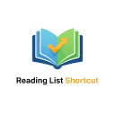

  

[Read this in Chinese (中文)](README.zh-CN.md)

## Chrome Web Store

[Add to Reading List on Chrome Web Store](https://chromewebstore.google.com/detail/add-to-reading-list/jocobpmmlobocfccfljmbfpmfdlgjfdo?authuser=0&hl=en)

# Add to Reading List

A simple Chrome extension that lets you quickly add the current page to Chrome's Reading List using a keyboard shortcut.

## Features

*   **Add** the current page to your reading list.
*   **Remove** the current page from your reading list.
*   **Mark** the current page as "read" in your reading list.
*   All actions are triggered by customizable keyboard shortcuts.

## Default Shortcuts

*   **Add to Reading List**: `Ctrl+M`
*   **Remove from Reading List**: `Ctrl+.`
*   **Mark as Read**: `Ctrl+,`
*   On Mac, use **Command** instead of **Ctrl**.

## Installation

1.  Download all the files in this repository (`manifest.json`, `background.js`, `options.html`, `128.png`, `content.js`, `notification.css`) and place them in a single folder on your computer.
2.  Open the Chrome browser and navigate to `chrome://extensions`.
3.  Enable the "Developer mode" switch in the top right corner.
4.  Click the "Load unpacked" button.
5.  In the file selector, choose the folder you created in the first step.
6.  The extension should now be installed and active!

## How to Use

*   **To Add a Page:** Navigate to the page and press `Ctrl+M`.
*   **To Remove a Page:** Navigate to a page that is already in your reading list and press `Ctrl+.`.
*   **To Mark a Page as Read:** Navigate to an unread page in your reading list and press `Ctrl+,`.

## Customizing the Shortcut

1.  In your Chrome browser, navigate to `chrome://extensions/shortcuts`.
2.  Find the "Add to Reading List" extension.
3.  Click the edit (pencil) icon next to the shortcut and enter your new preferred key combination.

## About the Icon

The extension uses a custom icon (`128.png`) that visually represents the Reading List functionality. The icon appears in:

* The Chrome extensions toolbar
* Extension management page
* Notifications when actions are performed

You can recognize the extension by this icon in your browser toolbar.
